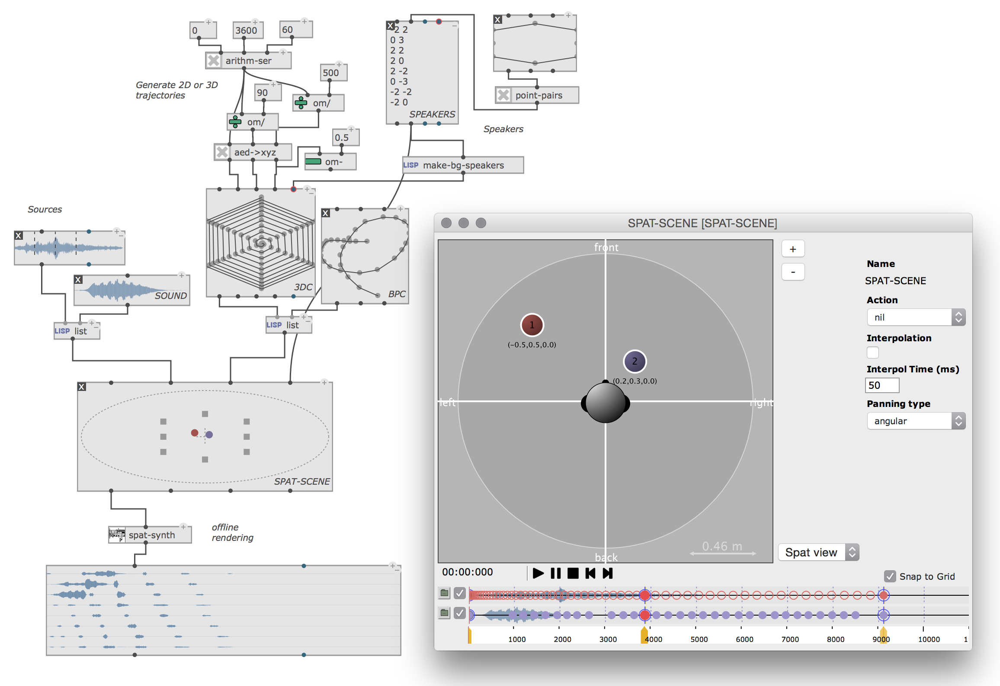
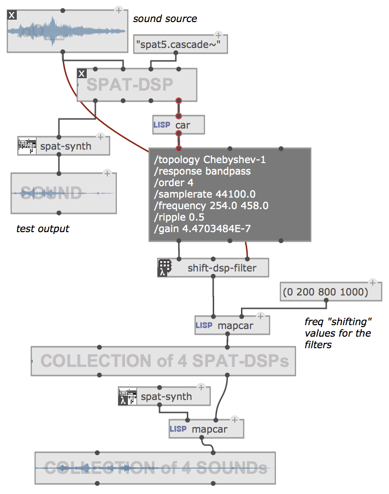
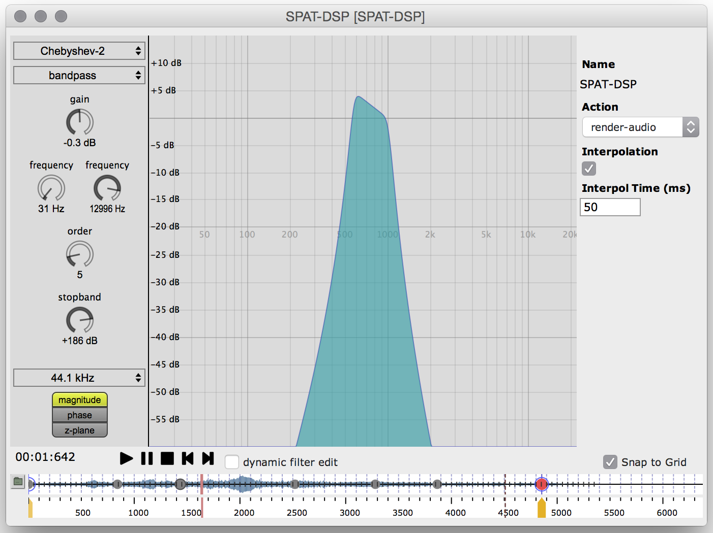
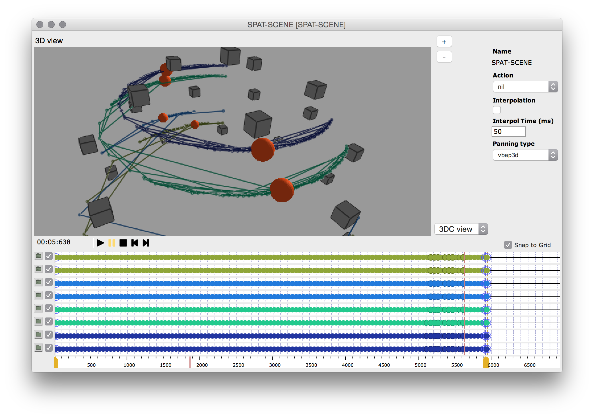

# Spat library for om# 

The **spat** library for om# allows to create and render spatial scenes using [Spat5](http://forumnet.ircam.fr/product/spat-en/).

The SPAT-DSP and SPAT-SCENE objects provide graphical controllers from the Spat library, as well as real-time audio rendering and OSC data streaming.

_This library does NOT include Spat sources or binaries, which must be installed separately and (if necessary) located in the Spat section of OM Preferences/Libraries tab._

Get Spat here: https://forum.ircam.fr/projects/detail/spat/

---------------------

This program is free software. It is distributed in the hope that it will be useful, but WITHOUT ANY WARRANTY, without even the implied warranty of MERCHANTABILITY or FITNESS FOR A PARTICULAR PURPOSE. 

---------------------

Design and development: Jean Bresson, Jérémie Garcia, IRCAM Representations Musicales.
Spat library by Thibaut Carpentier, IRCAM Acoustic and Cognitive Spaces.
